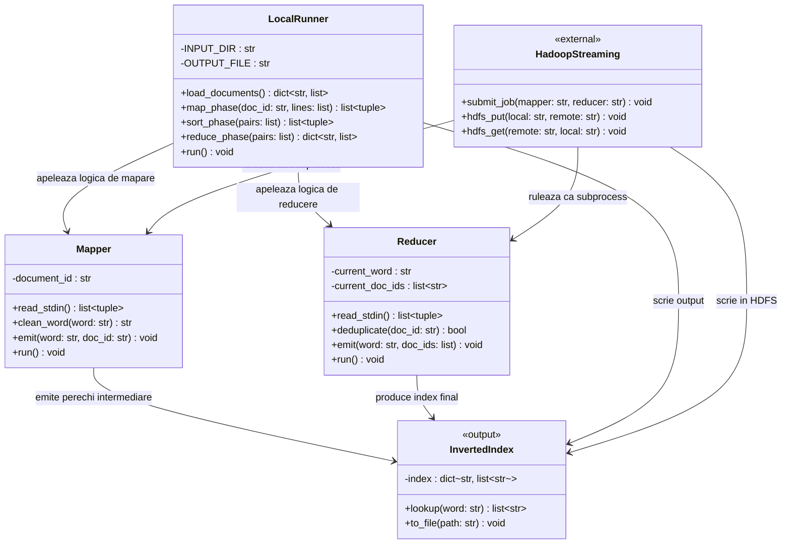

# Diagrama de clase — SPLSD-60 Inverted Index MapReduce

Diagrama de mai jos reprezintă arhitectura logică a soluției în format Mermaid.
Poate fi randată pe https://mermaid.live sau în orice editor Markdown cu suport Mermaid.

## Descriere clase

### `Mapper` (`mapper_inverted_index.py`)
Citeste linii din `stdin`, curata cuvintele (lowercase, fara punctuatie) si emite perechi `(cuvant, document_id)` pe `stdout`. Stie `document_id` din variabila de mediu `map_input_file`.

### `Reducer` (`reducer_inverted_index.py`)
Citeste perechi sortate din `stdin`, le grupeaza pe cheie (cuvant) si deduplica `document_id`-urile. Emite `(cuvant, [doc1, doc2, ...])` pe `stdout`.

### `LocalRunner` (`run_local.py`)
Simuleaza intregul pipeline MapReduce in Python pur, fara Hadoop. Apeleaza logica de mapare si reducere direct, fara subprocesse sau pipe-uri.

### `InvertedIndex` (structura de date finala)
Dictionar `word -> [doc_id_1, doc_id_2, ...]`. Reprezinta output-ul final al algoritmului, scris in `output_local.txt` sau `part-00000` (Hadoop).

### `HadoopStreaming` (sistem extern)
Componenta externa Apache Hadoop care orchestreaza rularea distribuita a mapper-ului si reducer-ului prin `hadoop-streaming*.jar`.
